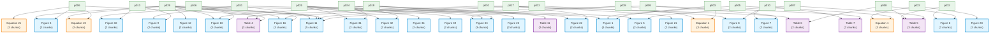

```mermaid
graph TD
    %% Citation Network - Top Referenced Objects

    %% Object Nodes
    figure_11["Figure 11<br/>(5 chunks)"]
    style figure_11 fill:#e1f5ff,stroke:#0288d1,stroke-width:2px
    figure_1["Figure 1<br/>(4 chunks)"]
    style figure_1 fill:#e1f5ff,stroke:#0288d1,stroke-width:2px
    figure_13["Figure 13<br/>(3 chunks)"]
    style figure_13 fill:#e1f5ff,stroke:#0288d1,stroke-width:2px
    figure_16["Figure 16<br/>(3 chunks)"]
    style figure_16 fill:#e1f5ff,stroke:#0288d1,stroke-width:2px
    figure_33["Figure 33<br/>(3 chunks)"]
    style figure_33 fill:#e1f5ff,stroke:#0288d1,stroke-width:2px
    table_4["Table 4<br/>(3 chunks)"]
    style table_4 fill:#f3e5f5,stroke:#7b1fa2,stroke-width:2px
    table_5["Table 5<br/>(3 chunks)"]
    style table_5 fill:#f3e5f5,stroke:#7b1fa2,stroke-width:2px
    equation_4["Equation 4<br/>(3 chunks)"]
    style equation_4 fill:#fff3e0,stroke:#f57c00,stroke-width:2px
    equation_1["Equation 1<br/>(3 chunks)"]
    style equation_1 fill:#fff3e0,stroke:#f57c00,stroke-width:2px
    figure_3["Figure 3<br/>(2 chunks)"]
    style figure_3 fill:#e1f5ff,stroke:#0288d1,stroke-width:2px
    figure_5["Figure 5<br/>(2 chunks)"]
    style figure_5 fill:#e1f5ff,stroke:#0288d1,stroke-width:2px
    figure_6["Figure 6<br/>(2 chunks)"]
    style figure_6 fill:#e1f5ff,stroke:#0288d1,stroke-width:2px
    figure_7["Figure 7<br/>(2 chunks)"]
    style figure_7 fill:#e1f5ff,stroke:#0288d1,stroke-width:2px
    figure_8["Figure 8<br/>(2 chunks)"]
    style figure_8 fill:#e1f5ff,stroke:#0288d1,stroke-width:2px
    figure_10["Figure 10<br/>(2 chunks)"]
    style figure_10 fill:#e1f5ff,stroke:#0288d1,stroke-width:2px
    figure_9["Figure 9<br/>(2 chunks)"]
    style figure_9 fill:#e1f5ff,stroke:#0288d1,stroke-width:2px
    figure_12["Figure 12<br/>(2 chunks)"]
    style figure_12 fill:#e1f5ff,stroke:#0288d1,stroke-width:2px
    figure_21["Figure 21<br/>(2 chunks)"]
    style figure_21 fill:#e1f5ff,stroke:#0288d1,stroke-width:2px
    figure_22["Figure 22<br/>(2 chunks)"]
    style figure_22 fill:#e1f5ff,stroke:#0288d1,stroke-width:2px
    figure_23["Figure 23<br/>(2 chunks)"]
    style figure_23 fill:#e1f5ff,stroke:#0288d1,stroke-width:2px
    figure_28["Figure 28<br/>(2 chunks)"]
    style figure_28 fill:#e1f5ff,stroke:#0288d1,stroke-width:2px
    figure_31["Figure 31<br/>(2 chunks)"]
    style figure_31 fill:#e1f5ff,stroke:#0288d1,stroke-width:2px
    figure_32["Figure 32<br/>(2 chunks)"]
    style figure_32 fill:#e1f5ff,stroke:#0288d1,stroke-width:2px
    figure_34["Figure 34<br/>(2 chunks)"]
    style figure_34 fill:#e1f5ff,stroke:#0288d1,stroke-width:2px
    figure_39["Figure 39<br/>(2 chunks)"]
    style figure_39 fill:#e1f5ff,stroke:#0288d1,stroke-width:2px
    table_6["Table 6<br/>(2 chunks)"]
    style table_6 fill:#f3e5f5,stroke:#7b1fa2,stroke-width:2px
    table_7["Table 7<br/>(2 chunks)"]
    style table_7 fill:#f3e5f5,stroke:#7b1fa2,stroke-width:2px
    table_11["Table 11<br/>(2 chunks)"]
    style table_11 fill:#f3e5f5,stroke:#7b1fa2,stroke-width:2px
    equation_21["Equation 21<br/>(2 chunks)"]
    style equation_21 fill:#fff3e0,stroke:#f57c00,stroke-width:2px
    equation_23["Equation 23<br/>(2 chunks)"]
    style equation_23 fill:#fff3e0,stroke:#f57c00,stroke-width:2px

    %% Chunk Nodes (Top 20)
    unit_002_page_029["p029"]
    style unit_002_page_029 fill:#e8f5e9,stroke:#388e3c,stroke-width:1px
    unit_001_page_025["p025"]
    style unit_001_page_025 fill:#e8f5e9,stroke:#388e3c,stroke-width:1px
    unit_002_page_031["p031"]
    style unit_002_page_031 fill:#e8f5e9,stroke:#388e3c,stroke-width:1px
    unit_001_page_019["p019"]
    style unit_001_page_019 fill:#e8f5e9,stroke:#388e3c,stroke-width:1px
    unit_001_page_006["p006"]
    style unit_001_page_006 fill:#e8f5e9,stroke:#388e3c,stroke-width:1px
    unit_001_page_009["p009"]
    style unit_001_page_009 fill:#e8f5e9,stroke:#388e3c,stroke-width:1px
    unit_001_page_013["p013"]
    style unit_001_page_013 fill:#e8f5e9,stroke:#388e3c,stroke-width:1px
    unit_001_page_017["p017"]
    style unit_001_page_017 fill:#e8f5e9,stroke:#388e3c,stroke-width:1px
    unit_001_page_024["p024"]
    style unit_001_page_024 fill:#e8f5e9,stroke:#388e3c,stroke-width:1px
    unit_001_page_008["p008"]
    style unit_001_page_008 fill:#e8f5e9,stroke:#388e3c,stroke-width:1px
    unit_001_page_010["p010"]
    style unit_001_page_010 fill:#e8f5e9,stroke:#388e3c,stroke-width:1px
    unit_001_page_012["p012"]
    style unit_001_page_012 fill:#e8f5e9,stroke:#388e3c,stroke-width:1px
    unit_001_page_003["p003"]
    style unit_001_page_003 fill:#e8f5e9,stroke:#388e3c,stroke-width:1px
    unit_001_page_005["p005"]
    style unit_001_page_005 fill:#e8f5e9,stroke:#388e3c,stroke-width:1px
    unit_001_page_016["p016"]
    style unit_001_page_016 fill:#e8f5e9,stroke:#388e3c,stroke-width:1px
    unit_002_page_028["p028"]
    style unit_002_page_028 fill:#e8f5e9,stroke:#388e3c,stroke-width:1px
    unit_002_page_030["p030"]
    style unit_002_page_030 fill:#e8f5e9,stroke:#388e3c,stroke-width:1px
    unit_001_page_007["p007"]
    style unit_001_page_007 fill:#e8f5e9,stroke:#388e3c,stroke-width:1px
    unit_002_page_032["p032"]
    style unit_002_page_032 fill:#e8f5e9,stroke:#388e3c,stroke-width:1px
    unit_001_page_022["p022"]
    style unit_001_page_022 fill:#e8f5e9,stroke:#388e3c,stroke-width:1px

    %% Citation Edges
    unit_001_page_009 --> figure_11
    unit_001_page_012 --> figure_11
    unit_001_page_013 --> figure_11
    unit_002_page_029 --> figure_11
    unit_002_page_031 --> figure_11
    unit_001_page_003 --> figure_1
    unit_001_page_005 --> figure_1
    unit_002_page_029 --> figure_1
    unit_001_page_016 --> figure_13
    unit_001_page_019 --> figure_13
    unit_002_page_029 --> figure_13
    unit_001_page_016 --> figure_16
    unit_001_page_017 --> figure_16
    unit_002_page_029 --> figure_16
    unit_001_page_024 --> figure_33
    unit_001_page_025 --> figure_33
    unit_002_page_028 --> figure_33
    unit_001_page_006 --> table_4
    unit_002_page_029 --> table_4
    unit_002_page_030 --> table_4
    unit_001_page_007 --> table_5
    unit_001_page_008 --> table_5
    unit_002_page_032 --> table_5
    unit_001_page_003 --> equation_4
    unit_002_page_028 --> equation_4
    unit_001_page_005 --> equation_1
    unit_001_page_022 --> equation_1
    unit_001_page_006 --> figure_3
    unit_002_page_029 --> figure_3
    unit_001_page_007 --> figure_5
    unit_002_page_031 --> figure_5
    unit_001_page_008 --> figure_6
    unit_002_page_032 --> figure_6
    unit_001_page_009 --> figure_7
    unit_001_page_010 --> figure_7
    unit_001_page_010 --> figure_8
    unit_001_page_012 --> figure_8
    unit_001_page_013 --> figure_10
    unit_002_page_031 --> figure_10
    unit_001_page_013 --> figure_9
    unit_002_page_031 --> figure_9
    unit_002_page_029 --> figure_12
    unit_001_page_017 --> figure_21
    unit_001_page_017 --> figure_22
    unit_001_page_019 --> figure_22
    unit_001_page_019 --> figure_23
    unit_001_page_022 --> figure_28
    unit_001_page_024 --> figure_31
    unit_001_page_025 --> figure_31
    unit_001_page_024 --> figure_32
    unit_001_page_025 --> figure_32
    unit_001_page_025 --> figure_34
    unit_001_page_025 --> figure_39
    unit_001_page_008 --> table_6
    unit_002_page_030 --> table_6
    unit_001_page_009 --> table_7
    unit_001_page_010 --> table_7
    unit_001_page_019 --> table_11
    unit_001_page_006 --> equation_21
    unit_001_page_006 --> equation_23
    unit_002_page_029 --> equation_23
```